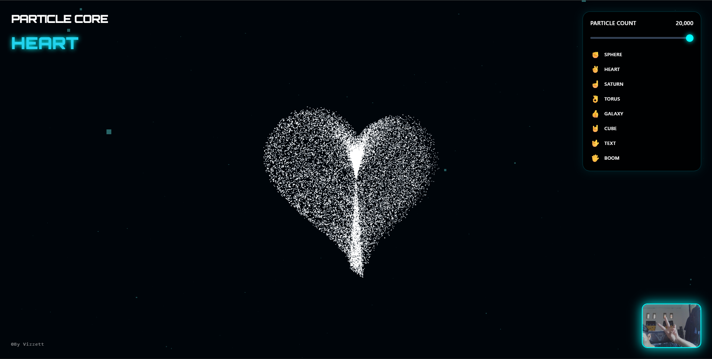

Hand Tracking | Particle Core 🔮

Sistem Partikel 3D Interaktif yang dikendalikan langsung oleh Gestur Tangan. Dibangun menggunakan teknologi grafis tingkat tinggi Three.js dan kecerdasan buatan MediaPipe AI.

🔗 Coba Sekarang (Live Demo): https://trackingparticle.vercel.app/

🌟 Fitur Utama

Pelacakan Tangan Real-time: Mendeteksi gerakan tangan dan jari Anda secara instan melalui webcam tanpa perlu alat tambahan.
8 Gestur Interaktif: Ubah bentuk ribuan partikel hanya dengan pose tangan:

✊ Kepalan Tangan (Fist): Memadat menjadi Bola Energi (Sphere Core).
✌️ Victory (Dua Jari): Membentuk Hati 3D (Heart).
☝️ Telunjuk (Point): Membentuk Planet Saturnus.
👌 OK Sign: Membentuk Geometri Donat (Torus).
👍 Jempol (Thumb Up): Membentuk Galaksi Spiral.
🤘 Metal/Rock: Membentuk Kubus Neon (Cube).
🖐️ Tangan Terbuka: Ledakan Partikel (Explosion/Boom).
🤟 ILY Sign: Memunculkan Teks "I LOVE U".

Desain Responsif: Tampilan menyesuaikan otomatis baik di Laptop/PC maupun HP (Mobile).
Estetika : Tampilan visual sci-fi futuristik dengan font Orbitron dan efek cahaya neon (Glow).

🛠️ Teknologi yang Digunakan

HTML5 & CSS3 (Styling dengan TailwindCSS)
JavaScript Modern (ES6+)
Three.js (Untuk Rendering Grafis & Partikel 3D)
MediaPipe (Computer Vision & AI Hand Tracking dari Google)

🚀 Cara Menjalankan di Komputer Lokal

Clone Repository ini:
git clone [https://github.com/vyzz-xz/tracking_particle.git]
Buka Folder Proyek:
Masuk ke folder yang baru saja di-download.
Jalankan Local Server:
Karena browser memblokir akses webcam jika membuka file HTML secara langsung (file://), Anda wajib menggunakan Local Server.
VS Code: Install ekstensi "Live Server", buka index.html, klik kanan lalu pilih "Open with Live Server".

📸 Tangkapan Layar (Screenshots)

Lisensi
©By Vizzett.